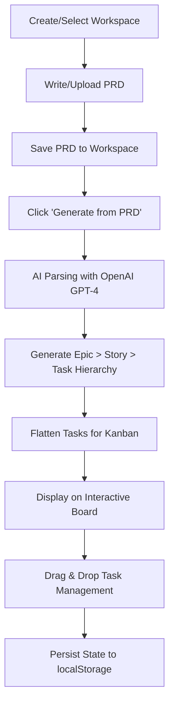

# Task Generation and Kanban Board System Guide

## Overview

SpecPrint uses an AI-powered system to transform Product Requirements Documents (PRDs) into structured, actionable project tasks displayed on an interactive Kanban board. This guide explains the entire workflow from PRD input to task management.

## 🔄 Complete Workflow



## 📝 1. PRD Input System

### **How PRDs are Created**
- **Text Input**: Type or paste PRD content directly into the text area
- **File Upload**: Upload `.txt` or `.md` files (up to 10MB)
- **Live Preview**: Real-time character count and content preview
- **Workspace Association**: Each PRD is saved to a specific workspace

### **PRD Storage Structure**
```
~/.aicodingtool/repos/[workspace-name]/
└── PRD.md (automatically generated with timestamp)
```

### **PRD Format Example**
```markdown
# Product Requirements Document

*Generated on: 2024-01-15 10:30:00*
*Workspace: my-project*

---

# Project Overview
This project aims to create a web application that...

## Features
- User authentication
- Data visualization  
- API integration

## Technical Requirements
- React frontend
- Node.js backend
- PostgreSQL database
```

## 🤖 2. AI-Powered Task Generation

### **Backend Processing Flow**

#### **Step 1: PRD Retrieval**
```go
func GenerateTasksFromWorkspacePRD(workspaceName string) TaskGenerationResult {
    // 1. Validate workspace exists
    // 2. Check PRD file exists
    // 3. Read PRD content from file system
    // 4. Pass to AI generation function
}
```

#### **Step 2: OpenAI Integration**
```go
func GenerateTasks(prdContent string) TaskGenerationResult {
    // 1. Create OpenAI client with API key
    // 2. Construct detailed system prompt
    // 3. Send PRD content to GPT-4o-mini
    // 4. Parse JSON response into structured data
    // 5. Validate hierarchy and relationships
}
```

### **AI System Prompt Structure**

The system uses a carefully crafted prompt to ensure consistent, structured output:

```
STRUCTURE:
- EPICS: High-level features or major components (3-6 epics)
- STORIES: User stories or functional requirements within each epic (2-5 stories per epic)  
- TASKS: Specific implementation tasks within each story (3-8 tasks per story)

RULES:
1. Organize by major functional areas (Epics)
2. Break down into user-focused stories
3. Create specific, actionable tasks
4. Consider dependencies and sequencing
5. Include setup, implementation, testing phases
6. Provide realistic time estimates
7. Aim for 3-6 epics, 2-5 stories per epic, 3-8 tasks per story
```

### **Generated Data Structure**

#### **Epic Level**
```typescript
interface Epic {
  id: number;                    // Unique identifier
  title: string;                 // Epic name (max 60 chars)
  description: string;           // Epic overview (max 150 chars)
  stories: Story[];              // Array of stories
}
```

#### **Story Level**
```typescript
interface Story {
  id: number;                    // Unique identifier
  epicId: number;                // Parent epic ID
  title: string;                 // Story name (max 80 chars)
  description: string;           // Story description (max 200 chars)
  tasks: Task[];                 // Array of tasks
}
```

#### **Task Level**
```typescript
interface Task {
  id: number;                    // Unique identifier
  storyId: number;               // Parent story ID
  title: string;                 // Task name (max 80 chars)
  description: string;           // What needs to be done (max 200 chars)
  dependencies: number[];        // Array of prerequisite task IDs
  priority: "high" | "medium" | "low";  // Task priority
  estimate: string;              // Time estimate (e.g., "2h", "1d", "3d")
}
```

## 🗂️ 3. Data Transformation Pipeline

### **Hierarchical to Flat Conversion**

When displaying on the Kanban board, the hierarchical structure is flattened while preserving context:

```typescript
// Original hierarchical task
{
  id: 1,
  title: "Create login form",
  description: "Build user login interface"
}

// Flattened for Kanban
{
  id: 1,
  title: "[User Authentication] Create login form",
  description: "Epic: User Authentication | Story: User Login | Build user login interface",
  status: "todo"  // Added for Kanban management
}
```

### **Status Assignment**
- All tasks start with `status: "todo"`
- Users can drag tasks between columns to change status:
  - `"todo"` → To Do column
  - `"in-progress"` → In Progress column  
  - `"done"` → Done column

## 📋 4. Kanban Board Architecture

### **Board State Management**

The board maintains a comprehensive state structure:

```typescript
interface BoardState {
  tasks: Task[];          // Flattened tasks with status
  epics: Epic[];          // Original epic hierarchy
  stories: Story[];       // Flattened stories from all epics
  lastUpdated: string;    // ISO timestamp
}
```

### **View Modes**

#### **Flat View** (Default)
- Traditional Kanban with individual task cards
- Tasks displayed as flat list in each column
- Epic context shown in task title and description

#### **Hierarchical View**
- Tasks grouped by Story within each column
- Collapsible story lanes with progress indicators
- Maintains drag-and-drop functionality
- Orphaned tasks grouped in "Other Tasks" section

### **Epic Filtering System**

Users can filter the entire board by Epic:

```typescript
// Filter tasks by selected epic
const filteredTasks = selectedEpicId 
  ? tasks.filter(task => 
      task.title.includes(`[${epicTitle}]`) ||
      task.description.includes(`Epic: ${epicTitle}`)
    )
  : tasks;  // Show all tasks if no epic selected
```

## 🔄 5. Drag & Drop System

### **React DnD Implementation**

The system uses `react-dnd` with HTML5 backend for smooth interactions:

#### **Drag Source (Task Cards)**
```typescript
const [{ isDragging }, drag] = useDrag({
  type: 'TASK',
  item: { task, sourceColumnId },
  collect: (monitor) => ({
    isDragging: monitor.isDragging(),
  }),
});
```

#### **Drop Targets (Columns & Story Lanes)**
```typescript
const [{ isOver }, drop] = useDrop({
  accept: 'TASK',
  drop: (item: { task: Task; sourceColumnId: string }) => {
    if (item.sourceColumnId !== targetColumnId) {
      onTaskMove(item.task, item.sourceColumnId, targetColumnId);
    }
  },
  collect: (monitor) => ({
    isOver: monitor.isOver(),
  }),
});
```

### **Status Update Logic**

When a task is dropped:

```typescript
const handleTaskMove = (task: Task, sourceColumnId: string, targetColumnId: string) => {
  const statusMap = {
    'todo': 'todo',
    'in-progress': 'in-progress', 
    'done': 'done'
  };

  const updatedTasks = boardState.tasks.map(t => 
    t.id === task.id 
      ? { ...t, status: statusMap[targetColumnId] }
      : t
  );

  setBoardState({
    ...boardState,
    tasks: updatedTasks,
    lastUpdated: new Date().toISOString(),
  });
};
```

## 💾 6. Data Persistence

### **Local Storage Strategy**

Board state is automatically saved to browser localStorage:

```typescript
// Save format
localStorage.setItem(`kanban-${workspaceName}`, JSON.stringify({
  tasks: [...],
  epics: [...], 
  stories: [...],
  lastUpdated: "2024-01-15T10:30:00.000Z"
}));

// Automatic saving triggers
useEffect(() => {
  if (selectedWorkspace && boardState.tasks.length > 0) {
    localStorage.setItem(`kanban-${selectedWorkspace.name}`, JSON.stringify(boardState));
  }
}, [boardState, selectedWorkspace]);
```

### **Workspace Isolation**

Each workspace maintains its own board state:
- Key format: `kanban-${workspaceName}`
- No cross-workspace data contamination
- Independent Epic/Story/Task management

## 📊 7. Progress Tracking

### **Epic Progress Calculation**

```typescript
const epicTasks = tasks.filter(task => 
  task.title.includes(`[${epic.title}]`)
);

const completedTasks = epicTasks.filter(task => task.status === 'done');
const progressPercentage = epicTasks.length > 0 
  ? Math.round((completedTasks.length / epicTasks.length) * 100)
  : 0;
```

### **Story Progress Calculation**

```typescript
const storyTasks = tasks.filter(task => 
  task.description.includes(`Story: ${story.title}`)
);

const completedTasks = storyTasks.filter(task => task.status === 'done');
const progressPercentage = storyTasks.length > 0 
  ? Math.round((completedTasks.length / storyTasks.length) * 100)
  : 0;
```

### **Visual Progress Indicators**

Progress bars use color coding:
- **Red (< 25%)**: `bg-red-500`
- **Orange (25-49%)**: `bg-orange-500`
- **Yellow (50-79%)**: `bg-yellow-500`
- **Green (≥ 80%)**: `bg-green-500`

## 🔧 8. Error Handling & Validation

### **PRD Validation**
- Non-empty content check
- File size limits (10MB max)
- File type validation (.txt, .md only)
- Workspace existence verification

### **AI Response Validation**
```go
// Validate epic structure
for _, epic := range epics {
    if epic.ID <= 0 || strings.TrimSpace(epic.Title) == "" {
        return TaskGenerationResult{
            Success: false,
            Message: "Invalid epic structure",
        }
    }
    
    // Validate stories and tasks...
}
```

### **Frontend Error States**
- API call failures with user-friendly messages
- Invalid JSON parsing from AI responses
- Network connectivity issues
- Missing workspace/PRD scenarios

## 🚀 9. Performance Optimizations

### **Efficient Rendering**
- React.memo for task cards to prevent unnecessary re-renders
- Virtual scrolling for large task lists (when implemented)
- Debounced localStorage writes
- Optimistic UI updates for drag operations

### **Data Structure Optimizations**
- Pre-computed task filtering for Epic views
- Memoized progress calculations
- Efficient story-task relationship mapping

## 🔄 10. Future Enhancements

### **Planned Features**
- **Real-time Collaboration**: WebSocket-based multi-user editing
- **Advanced Dependencies**: Visual dependency graphs
- **Time Tracking**: Built-in time logging for tasks
- **Export Options**: PDF/Excel export of boards
- **Template System**: Reusable PRD templates
- **Integration APIs**: GitHub, Jira, Trello sync

### **Scalability Considerations**
- Database backend for large teams
- Server-side task generation for consistency
- Advanced caching strategies
- Offline-first architecture

## 📝 Summary

The SpecPrint task generation and Kanban system provides:

1. **Seamless PRD to Task Conversion**: AI-powered parsing of requirements
2. **Structured Project Organization**: Epic → Story → Task hierarchy
3. **Flexible Visualization**: Multiple view modes and filtering options
4. **Interactive Management**: Drag-and-drop task status updates
5. **Progress Tracking**: Real-time Epic and Story completion metrics
6. **Data Persistence**: Reliable state management per workspace

This architecture ensures that project requirements are efficiently transformed into manageable, trackable work items with a rich, interactive user experience. 